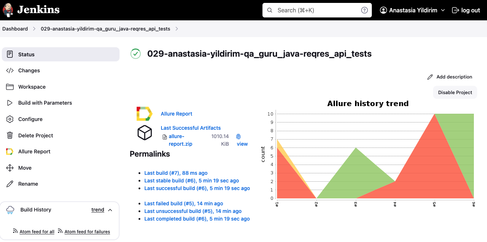
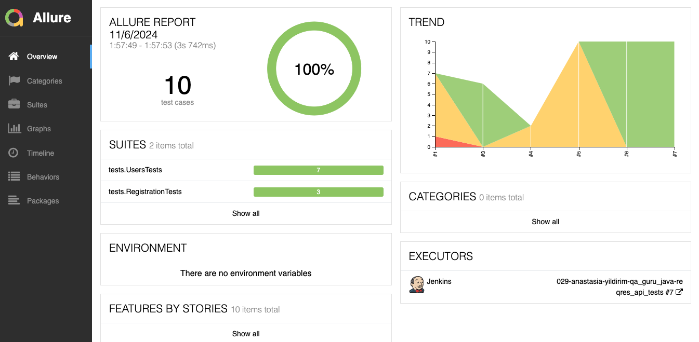
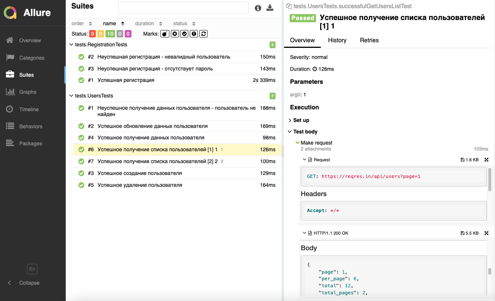
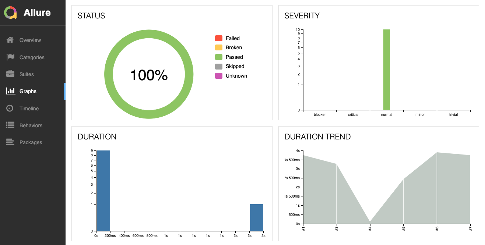
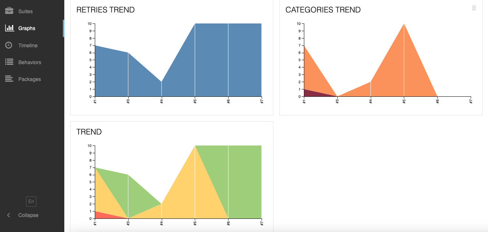
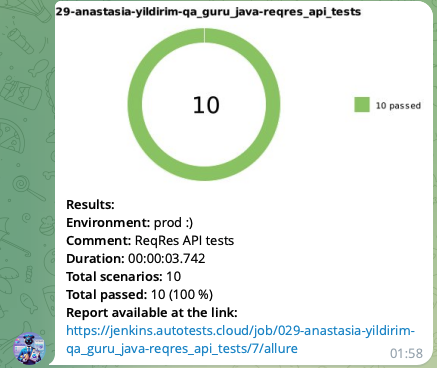

# Проект по автоматизации тестирования для [ReqRes](https://reqres.in)

> ReqRes — это бесплатный онлайн-сервис REST API, который предоставляет образцы данных для тестирования и прототипирования веб-приложений, позволяя разработчикам симулировать ответы API без необходимости в бэкенде.

## **Содержание:**
____

* <a href="#tools">Технологии и инструменты</a>

* <a href="#cases">Примеры автоматизированных тест-кейсов</a>

* <a href="#jenkins">Сборка в Jenkins</a>

* <a href="#console">Запуск из терминала</a>

* <a href="#allure">Allure отчет</a>

* <a href="#telegram">Уведомление в Telegram при помощи бота</a>
____
<a id="tools"></a>
## <a name="Технологии и инструменты">**Технологии и инструменты:**</a>

<p align="center">  
<a href="https://www.java.com/"></a>  
<a href="https://junit.org/junit5/"></a>  
<a href="https://gradle.org/"></a>  
<a href="ht[images](images)tps://github.com/allure-framework/allure2"></a>    
<a href="https://www.jenkins.io/"></a>  
</p>

____
<a id="cases"></a>
## <a name="Примеры автоматизированных тест-кейсов">**Примеры автоматизированных тест-кейсов:**</a>
____
- ✓ *Создание пользователя*
- ✓ *Обновление данных пользователя*
- ✓ *Получение данных пользователя*
- ✓ *Неуспешное получение данных пользователя - пользователь не найден*
- ✓ *Получение списка пользователей*
- ✓ *Удаление пользователя*

____
<a id="jenkins"></a>
## </a><a name="Сборка"></a>Сборка в [Jenkins](https://jenkins.autotests.cloud/job/029-anastasia-yildirim-qa_guru_java-reqres_api_tests/)</a>
____
<p align="center">  
<a href="https://jenkins.autotests.cloud/job/029-anastasia-yildirim-qa_guru_java-reqres_api_tests/"></a>  
</p>


### **Параметры сборки в Jenkins:**

- *baseURI (адрес тестируемого веб-сайта)*
- *basePath ()*

<a id="console"></a>
## Команды для запуска из терминала
___
***Локальный запуск:***

```bash  
gradle clean test
```


***Удалённый запуск через Jenkins:***
```bash  
clean test
"-DbaseURI=${baseURI}"
"-DbasePath=${basePath}"
```
___
<a id="allure"></a>
## </a> <a name="Allure"></a>Allure [отчет](https://jenkins.autotests.cloud/job/029-anastasia-yildirim-qa_guru_java-reqres_api_tests/7/allure)</a>
___

### *Основная страница отчёта*

<p align="center">  
  
</p>  

### *Тест-кейсы*

<p align="center">  
  
</p>

### *Графики*

  <p align="center">  


  
</p>

____
<a id="telegram"></a>
## </a> Уведомление в Telegram при помощи бота
____
<p align="center">  
  
</p>
